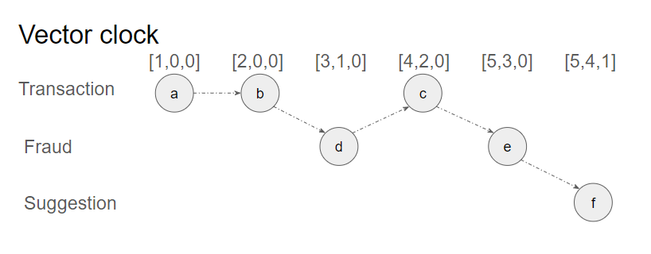
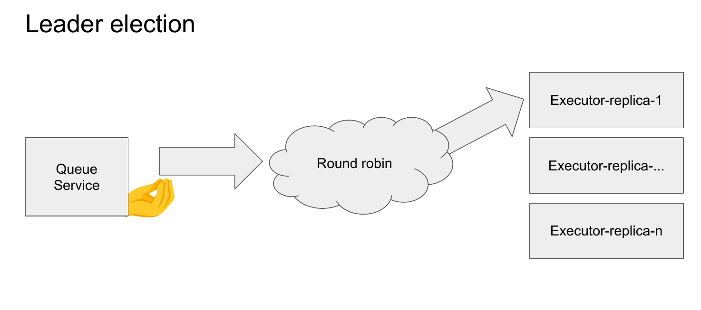
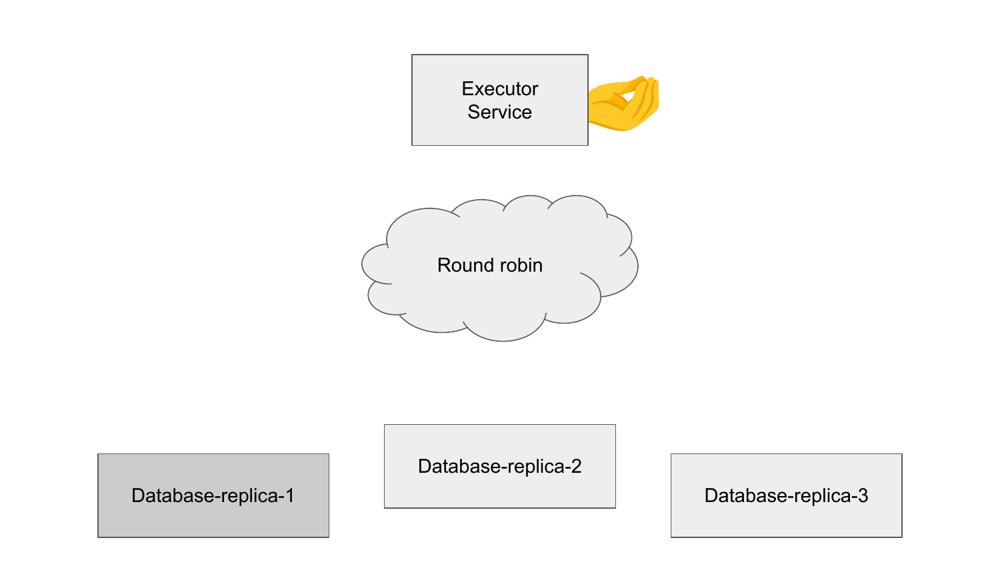

# Documentation
This is online bookshop project, with frontend and backend components(aka orchestrator) and microservices for fraud deteciton, transaction verification and suggestions.
- [Documentation](#documentation)
  - [Checkpoint V1 (Charlie)](#checkpoint-v1-charlie)
    - [Architecture Diagram](#architecture-diagram)
    - [Flow Diagram](#flow-diagram)
    - [Microservices logic](#microservices-logic)
  - [Checkpoint V2](#checkpoint-v2)
    - [Temporal relation](#temporal-relation)
    - [Order queue with priority](#order-queue-with-priority)
    - [Executor election mechanism](#executor-election-mechanism)
  - [Checkpoint v3](#checkpoint-v3)
      - [Database replicas](#database-replicas)
        - [Order executor](#order-executor)

## Checkpoint V1 (Charlie)
### Architecture Diagram
The architecture comprises frontend service, orchestrator and three microservices. The microservices are isolated within docker network and their ports are not exposed for security concerns.

### Flow Diagram
The user-system interaction begins with a frontend, where after item/s selection and checkout button pressed the request to the backend is sent. It then launches 3 threads which each of which are submitting gRPC requests to the services and waits for them to respond. Once all responses are collected it then checks if the user is a fraud and if the transaction was verified and replies with proper response to the user, with additional list of suggested books.

### Microservices logic
Both fraud detection and transaction verification services are returning `False` if no issues were deteced, and `True` is something is wrong. The logic to do so is following:
* Fraud detection: if bank card of the user is non numeric or has length different from 16 the buyer is most likely a fraud.
* Transaction verification: if the card has not yet expired and user is not a fraud then the transaction MUST be valid
* Orhcestrator: if either of the services returns `False`, update order status accordingly
## Checkpoint V2
Important to keep in mind:
* Forget almost everything you saw before, and behold REDESIGN of the workflow!
* Abandon hope *all* ye enter here

### Temporal relation
<ol type="a">
  <li>transaction-verification service verifies if the order items (books) are not an empty list.</li>
  <li>transaction-verification service verifies if the mandatory user data (name, contact, address…) is all filled in.</li>
  <li>transaction-verification service verifies if the credit card information is in the correct format.</li>
  <li>fraud-detection service checks the user data for fraud.</li>
  <li>fraud-detection service checks the credit card data for fraud.</li>
  <li>suggestions service generates book suggestions.</li>
</ol>

Relation between these events: a -> b , b -> d , d -> c , c -> e , e -> f, which is also depicted in the diagram below.

### Order queue with priority

First, requests from orchestrator arrive into priority queue service, referred to as queue service. The priority is selected based  on the number of books in the shopping cart(up to 100, after which it decreases). The queue service then sends out requests to a single order executor abstracted behind load balancer, the connection is maintained until the order is executed, after which the next order can be sent out.

### Executor election mechanism

The mechanism of executor selector is simple, it's called **Round robin**, which mean each consequent request comes to the next executor servie in a circle. 

The service was provided with docker api access, which is **unsafe**, but the only way to get replica's name. Currently it supports as many replicates as desired by grand design.

## Checkpoint v3

#### Database replicas
The consistency is ensured using Primary-based protocol. The main node is always `replica-1` for simplicity. 
Implemented two types of requests:
 * Read: any node can return read result, since they are synced.
 * Write: if `replica-1` is in conact, it will send write requests to other nodes before responging ok. If any other node is engeged, it will first send write request to `replica-1`, which will broadcast it to others.

##### Order executor
The order executor try to get number of books in the database by sending book id. If book does not exist the executor then creates initial dummy stock of 10 books. If book is ordrered again, stock decreases.