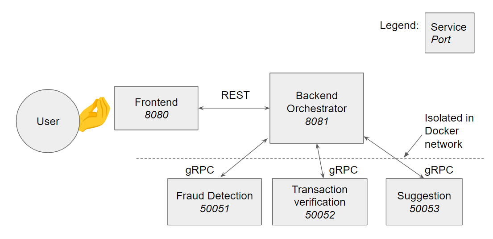
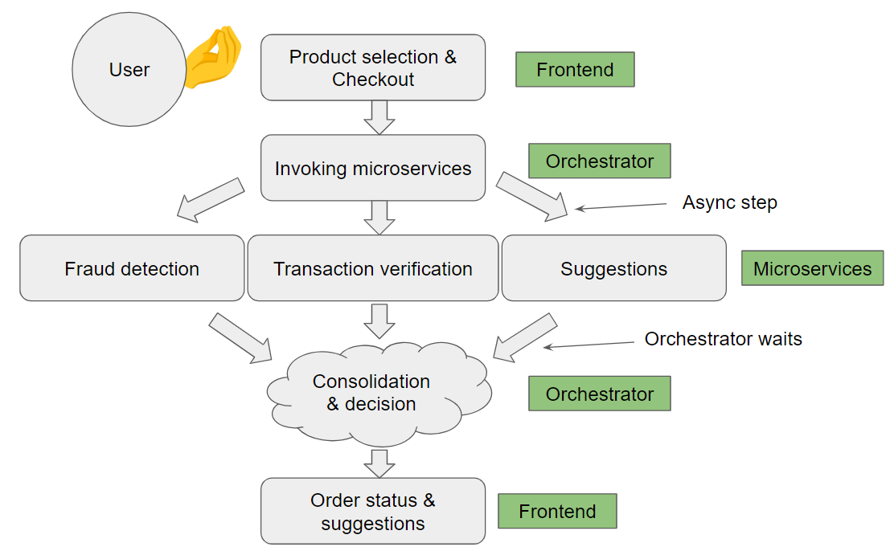

# Documentation
This is online bookshop project, with frontend and backend components(aka orchestrator) and microservices for fraud deteciton, transaction verification and suggestions.
## Architecture Diagram
The architecture comprises frontend service, orchestrator and three microservices. The microservices are isolated within docker network and their ports are not exposed for security concerns.

## Flow Diagram
The user-system interaction begins with a frontend, where after item/s selection and checkout button pressed the request to the backend is sent. It then launches 3 threads which each of which are submitting gRPC requests to the services and waits for them to respond. Once all responses are collected it then checks if the user is a fraud and if the transaction was verified and replies with proper response to the user, with additional list of suggested books.

## Microservices logic
Both fraud detection and transaction verification services are returning `False` if no issues were deteced, and `True` is something is wrong. The logic to do so is following:
* Fraud detection: if bank card of the user is non numeric or has length different from 16 the buyer is most likely a fraud.
* Transaction verification: if the card has not yet expired and user is not a fraud then the transaction MUST be valid
* Orhcestrator: if either of the services returns `False`, update order status accordingly
